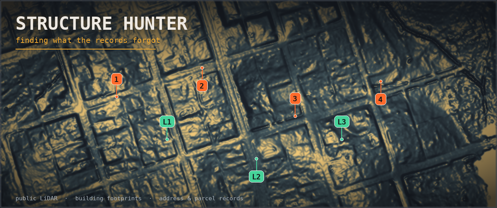
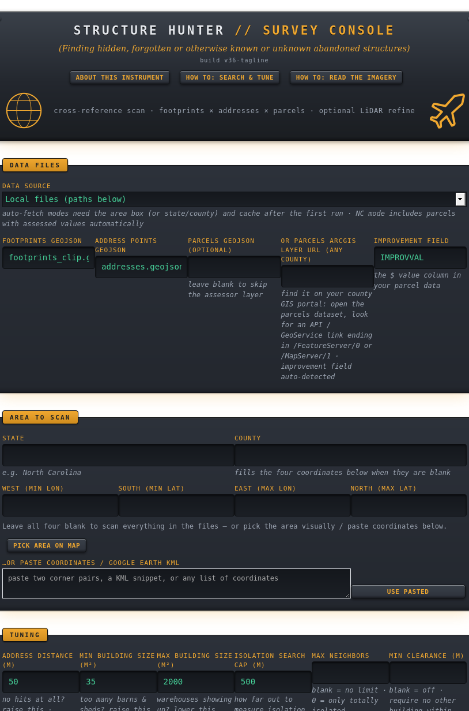

# Structure Hunter

**A survey console for finding structures that exist on the ground but are missing, hidden, or unacknowledged in official records.**

Structure Hunter cross-references *what is physically there* — building footprints and the raw shape of the land from aerial laser scanning (LiDAR) — against *what is officially registered* — address points and tax parcels. Where a structure exists but no record claims it, that gap is a candidate: an unregistered cabin, a forgotten outbuilding, an abandoned homestead, a structure hidden under tree canopy, or the ghost of a foundation long since overgrown.

It runs entirely on your own machine as a local web app. Everything it uses is public, authoritative data: OpenStreetMap and state building footprints, the National Address Database and state address points, county parcel layers, and USGS 3DEP LiDAR and elevation models.



---

## What it does

- **Footprint-vs-address join** — flags buildings with no nearby registered address.
- **LiDAR structure detection** — builds a bare-earth model from laser point clouds and finds smooth, raised, building-like shapes the footprint maps never recorded, including ones under canopy.
- **Live relief rendering** — re-light and stretch the terrain in your browser instantly (sun direction, vertical exaggeration, hillshade / multi-direction / sky-view modes, contrast stretch) to reveal faint foundations, pads, and earthworks.
- **Shape filtering** — tells round storage tanks from buildings using geometric descriptors (circularity, convex-hull solidity).
- **Isolation & clearance filters** — find structures with no registered neighbors and/or no other physical building within a set distance.
- **Threshold calibration** — measures the data for your area and recommends how to set the registration threshold, instead of guessing.
- **Parallel downloads & caching** — fetches LiDAR tiles concurrently and caches everything, so repeat visits are fast.
- **Interactive results** — numbered markers on the imagery linked both ways to ranked candidate tables; double-tap any spot to open it in Google Maps satellite view.

Built-in **About** and two **How-to** guides (search & tuning; reading the imagery) explain the science and the workflow inside the app itself.

---

## Quick start

You need **Ruby** (the app itself) and **Python 3** with a few packages (only for the LiDAR features).

### 1. Install Ruby

- **macOS:** Ruby is usually preinstalled. Check with `ruby --version`. If missing, install via [Homebrew](https://brew.sh): `brew install ruby`.
- **Windows:** install from [RubyInstaller](https://rubyinstaller.org/).
- **Linux:** `sudo apt install ruby` (Debian/Ubuntu) or your distro's equivalent.

Ruby 3.0 or newer is recommended. The app uses only the Ruby standard library — no gems to install.

### 2. Install Python packages (for LiDAR)

You can run the program without these — the footprint-vs-address scan works on Ruby alone — but the LiDAR and elevation features need:

```bash
pip install numpy laspy lazrs pyproj rasterio
```

(On some systems use `pip3`, and you may need `--break-system-packages` on recent Linux.)

A helper script is included:

```bash
# macOS / Linux
./setup.sh
```

### 3. Run it

```bash
ruby hunter.rb
```

Then open **http://localhost:8080** in your browser.

That's it. The terminal will print the version and the address. Press **Ctrl+C** to stop.

---

## How to use it

Open the app and read the **About** and **How-to** buttons at the top — they walk through everything. In brief:

1. **Pick an area** — type a county and state, tap two corners on the built-in satellite map, or paste coordinates.
2. **Choose a data source** — NC OneMap (best, North Carolina), the National Address Database, or OpenStreetMap (anywhere in the US).
3. **Run a scan** — candidates appear as ranked tables. Turn on LiDAR for the bare-earth imagery and structure hunt.
4. **Tune** — use the calibration readout to set the registration threshold, then filter by size, isolation, clearance, and shape.
5. **Investigate** — work the live relief controls on the imagery to reveal faint features, and double-tap anything interesting to see it in Google Maps.

---

## Data sources

| Source | Coverage | Notes |
|---|---|---|
| OpenStreetMap (Overpass) | Worldwide | Building footprints; address coverage varies, often sparse in rural areas |
| National Address Database | US | Federal address point compilation |
| NC OneMap | North Carolina | Highest quality; includes parcels with assessed values |
| USGS 3DEP | US | LiDAR point clouds and 1 m elevation models |
| Generic ArcGIS parcel layers | Varies | Paste any county parcel FeatureServer/MapServer URL |

All data is fetched live from these public services and cached locally.

---

## Requirements summary

- **Ruby** 3.0+ (standard library only)
- **Python** 3 with `numpy`, `laspy`, `lazrs`, `pyproj`, `rasterio` (LiDAR features only)
- A modern web browser
- Disk space for the cache (LiDAR tiles are 60–150 MB each; clear them from the in-app Cache panel anytime)

---

## Responsible use

Structure Hunter is a research and survey tool. Findings are **candidates, not conclusions** — confirm them against imagery and, where appropriate, on the ground and with permission.

- Use it for legitimate purposes: historical and archaeological survey, research on your own property, land and conservation work, and education.
- "No record" sometimes means "not yet mapped," not "deliberately hidden" — sparse data is exactly where unregistered structures hide, but it cuts both ways.
- Respect privacy, property rights, and local laws. Do not use this tool to trespass, harass, surveil, or target individuals.

See [`DISCLAIMER.md`](DISCLAIMER.md) for the full notice.

---

## How it works (the short version)

- **Spatial join** uses the shoelace formula (polygon area & centroid) and a grid spatial index for fast nearest-point queries.
- **LiDAR** builds a Digital Surface Model (highest returns) and a Digital Terrain Model (interpolated bare ground), then subtracts them to get height-above-ground; smooth raised blobs are structure candidates, ragged ones are vegetation.
- **Shape analysis** computes circularity (isoperimetric ratio) and solidity (via a monotone-chain convex hull) to separate round tanks from buildings.
- **Relief rendering** computes hillshade, multi-directional, and sky-view shading from the elevation grid — live in the browser — so you can interrogate the same measured data in different ways.

The full explanation lives in the app's **About** panel.

---

## License

[MIT](LICENSE) — free to use, modify, and share.

---

## Contributing

Issues and pull requests are welcome. This started as a personal learning project and grew into a complete instrument; if you find it useful or improve it, that's the best outcome.
