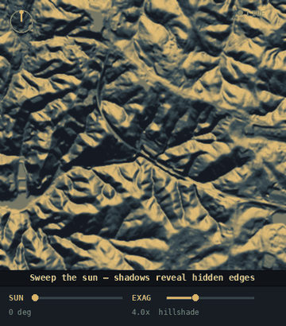

# Structure Hunter

**A survey console for finding structures that exist on the ground but are missing, hidden, or unacknowledged in official records — and for finding the physical remains of structures the records still claim are there but aren't.**

Structure Hunter cross-references *what is physically there* — building footprints and the raw shape of the land from aerial laser scanning (LiDAR) — against *what is officially registered* — address points and tax parcels. Where the two disagree, that gap is a candidate.

It finds two fundamentally different kinds of thing:

- **Unregistered structures** — buildings the addressing and parcel systems never recorded: an unpermitted cabin, an off-grid dwelling, a forgotten outbuilding, a structure deep in the woods with no road to it, or one hidden under tree canopy.
- **Abandoned structures and ruins** — the opposite mismatch: places the records still call a "house" but the ground shows only a foundation slab, low walls, or a leveled pad. Abandoned homes keep their address points for decades, so an ordinary address scan is blind to them — but their physical remains show up in the LiDAR.

It runs entirely on your own machine as a local web app. Everything it uses is public, authoritative data: OpenStreetMap and state building footprints, the National Address Database and state address points, county parcel layers, the OSM road network, and USGS 3DEP LiDAR and elevation models.




---

## Two ways of seeing what's really on the ground

Structure Hunter has two complementary detection modes. Most other tools do only the first.

### 1. Address & parcel cross-reference — finds the *unregistered*

For every building footprint, it finds the nearest registered address point. No address close enough? That structure is unclaimed — a candidate. This finds things that were **never entered into the addressing system**: structures built without a permit, on unaddressed land, or off any road the county recorded.

### 2. LiDAR physical detection — finds the *abandoned and the hidden*

LiDAR doesn't care about records. It sees what is physically present (or what is left). Two sub-modes:

- **Standing structures** — builds a bare-earth model from laser point clouds and flags smooth, raised, building-shaped objects the footprint maps never recorded, **including ones beneath winter tree canopy** that aerial imagery can't see.
- **Ruins mode** — retunes the detector for *low* features (foundation slabs, low walls, leveled pads, roughly 0.25–1.8 m high) instead of wall-height buildings, and **ignores addresses entirely**. This is the "records say house, ground says foundation" case. Rectangularity is the key signal: a low rectangular feature is almost certainly man-made, while a low irregular blob is natural ground.

---

## What it does

**Detection**

- **Footprint-vs-address join** — flags buildings with no nearby registered address.
- **LiDAR structure detection** — finds building-like shapes unknown to the footprint maps, including under canopy.
- **Ruins / foundations mode** — finds low foundation-height remains, address-independent, for abandoned sites.

**Understanding each candidate**

- **Shape & type classifier** — for every candidate, derives a true oriented bounding rectangle, shape family (square, rectangle, long rectangle, L/T-shaped, elongated, circular, irregular), and a *likely type* from shape + real size (shed, possible dwelling, likely dwelling with wing, barn, warehouse, tank/silo, and more). Each comes with a small drawn glyph of the actual footprint, scaled so its on-screen size reflects the real structure size, with a 25 m reference square.
- **Roof shape** — for LiDAR candidates, reads roof form from the height data (flat / pitched / steep) and sharpens the type guess: a pitched roof on a house-sized rectangle reads as a likely dwelling; a flat one leans shed/commercial; a domed circle is a silo vs a flat-topped tank.
- **Shape filtering** — tells round storage tanks from buildings using circularity and convex-hull solidity, so a lone tank is flagged but a tank with a building attached still passes.
- **Shape search** — find buildings by shape two ways: filter to a shape family (long & thin, L/T-shaped, square, circular…), or give a *specific outline* — tap a preset (rectangle, L, T, octagon, diamond…), sketch corners on a click-to-draw pad, or paste coordinates — and every candidate is ranked by how closely it matches. Matching uses Hu invariant moments, so it's rotation-, scale-, and mirror-independent: the same shape matches at any angle or size.

**Context & accuracy**

- **Parcel use & ownership** (with NC OneMap) — shows each candidate's tax use (e.g. SFR, COMMERCIAL, CHURCH) and site address, and automatically flags non-residential, industrial, and institutional uses.
- **Industrial / institutional suppression** — recognizes industrial sites and rail yards (so warehouses and rail buildings don't flood results) and civic/religious/recreational sites — churches, schools, rec centers, clubs — which match the "no nearby address" signature for innocent reasons. Flag-and-sink by default, or reject entirely.
- **OSM zone checks** — fetches industrial, railway, and institutional land-use from OpenStreetMap so the same suppression works anywhere, not just where parcel data exists.
- **Road distance & estimated address** — fetches the road network and shows how far each candidate sits from the nearest road, flagging the genuinely **roadless deep-woods finds**, plus a reverse-geocode-style estimated street (clearly labeled as an estimate, not a registered address).
- **Building-cluster filter** — counts nearby buildings to drop candidates sitting inside dense developments.
- **Isolation & clearance filters** — find structures with no registered neighbors and/or no other physical building within a set distance.

**Workflow**

- **Threshold calibration** — measures the registration distance distribution for your area and recommends the threshold, instead of guessing.
- **Dismiss & remember** — mark a candidate "not interesting" and it's skipped on future scans (matched by location, survives a cache clear); a collapsible panel lets you review and restore.
- **Saved-places archive** — a ★ save button on every candidate (in any result mode) adds it to a running investigation archive, capturing what the tool knew about it (likely type, shape, notes, which mode found it) plus an optional note you type. The archive persists across scans and survives cache clears, so it's a genuine running list of everywhere you want to look closer. A dedicated panel lets you review each place, open it in Google Maps, edit its note, or remove it — and **export the whole list to GeoJSON or CSV** to carry into the field (Google Earth, QGIS, a GPS app).
- **LiDAR focus for big areas** — a county is too large to scan whole, so it focuses windows on the top candidates — choose the top one, the top three, a specific candidate, or "next unexamined," which remembers what you've already looked at and sweeps forward across runs.
- **Live relief rendering** — re-light and stretch the terrain in your browser instantly (sun direction, vertical exaggeration, hillshade / multi-direction / sky-view / local-relief modes, contrast stretch) to reveal faint foundations, pads, and earthworks.
- **Parallel downloads & caching** — fetches address/parcel data and LiDAR tiles concurrently (with verification and auto-retry on truncated downloads) and caches everything, so big areas and repeat visits are fast.
- **Interactive results** — numbered markers on the imagery linked both ways to ranked candidate tables; double-tap any spot to open it in Google Maps satellite view; full results also written to CSV and GeoJSON.

**Specialized searches**

- **Closed institutions & dead retail** — a focused mode (instead of the normal scan) that finds defunct schools, jails, hospitals, and civic buildings, plus dead malls, department stores, and supermarkets. It combines two signals: **OSM lifecycle tags** — sites mappers have marked *disused*, *abandoned*, or *demolished* (works in any state) — and, where a parcel source is set, a **parcel value heuristic**: an institutional or large-retail parcel whose building value has collapsed to near zero, which is the tax records' own signature of a vacated, condemned, or demolished building (the land keeps its value, the structure does not). Results are tagged civic vs retail and point you to state archives, the National Register, dead-mall trackers, and county property records to confirm. Only large-format retail is included, since small shops turn over too often to be a useful signal.

Built-in **About** and two **How-to** guides (search & tuning; reading the imagery) explain the science and the workflow inside the app itself.

---

## Quick start

You need **Ruby** (the app itself) and **Python 3** with a few packages (only for the LiDAR features).

### 1. Install Ruby

- **macOS:** Ruby is usually preinstalled. Check with `ruby --version`. If missing, install via [Homebrew](https://brew.sh): `brew install ruby`.
- **Windows:** install from [RubyInstaller](https://rubyinstaller.org/).
- **Linux:** `sudo apt install ruby` (Debian/Ubuntu) or your distro's equivalent.

Ruby 3.0 or newer is recommended. The app uses only the Ruby standard library — no gems to install.

### 2. Install Python packages (for LiDAR)

You can run the program without these — the footprint-vs-address scan works on Ruby alone — but the LiDAR, ruins, and elevation features need:

```bash
pip install numpy laspy lazrs pyproj rasterio
```

(On some systems use `pip3`, and you may need `--break-system-packages` on recent Linux.)

A helper script is included:

```bash
# macOS / Linux
./setup.sh
```

### 3. Run it

```bash
ruby hunter.rb
```

Then open **http://localhost:8080** in your browser.

That's it. The terminal will print the version and the address. Press **Ctrl+C** to stop.

---

## How to use it

Open the app and read the **About** and **How-to** buttons at the top — they walk through everything. In brief:

1. **Pick an area** — type a county and state, tap two corners on the built-in satellite map, or paste coordinates.
2. **Choose a data source** — NC OneMap (best, North Carolina), the National Address Database, or OpenStreetMap (anywhere in the US).
3. **Run a scan** — candidates appear as ranked tables, each with its shape, likely type, and context. Turn on LiDAR for the bare-earth imagery and structure hunt, and tick **ruins mode** to hunt foundations and abandoned sites.
4. **Add context** — turn on the zone, road, and institutional checks to suppress churches/warehouses/rec-centers and surface the remote, roadless finds.
5. **Tune** — use the calibration readout to set the registration threshold, then filter by size, isolation, clearance, cluster, and shape.
6. **Investigate** — work the live relief controls on the imagery to reveal faint features, dismiss the ones that aren't interesting, and double-tap anything promising to see it in Google Maps.

---

## Data sources

| Source | Coverage | Notes |
|---|---|---|
| OpenStreetMap (Overpass) | Worldwide | Building footprints, roads, and land-use zones; address coverage varies, often sparse in rural areas |
| National Address Database | US | Federal address point compilation |
| NC OneMap | North Carolina | Highest quality; includes parcels with assessed values, use codes, and ownership |
| USGS 3DEP | US | LiDAR point clouds and 1 m elevation models |
| Generic ArcGIS parcel layers | Varies | Paste any county parcel FeatureServer/MapServer URL |

All data is fetched live from these public services and cached locally.

---

## Requirements summary

- **Ruby** 3.0+ (standard library only)
- **Python** 3 with `numpy`, `laspy`, `lazrs`, `pyproj`, `rasterio` (LiDAR features only)
- A modern web browser
- Disk space for the cache (LiDAR tiles are 60–150 MB each; clear them from the in-app Cache panel anytime)

---

## Responsible use

Structure Hunter is a research and survey tool. Findings are **candidates, not conclusions** — confirm them against imagery and, where appropriate, on the ground and with permission.

- Use it for legitimate purposes: historical and archaeological survey, research on your own property, land and conservation work, and education.
- "No record" sometimes means "not yet mapped," not "deliberately hidden" — sparse data is exactly where unregistered structures hide, but it cuts both ways. Likewise, an abandoned-looking foundation may sit on private land with a very present owner.
- Respect privacy, property rights, and local laws. Do not use this tool to trespass, harass, surveil, or target individuals.

See [`DISCLAIMER.md`](DISCLAIMER.md) for the full notice.

---

## How it works (the short version)

- **Spatial join** uses the shoelace formula (polygon area & centroid) and a grid spatial index for fast nearest-point queries.
- **LiDAR** builds a Digital Surface Model (highest returns) and a Digital Terrain Model (interpolated bare ground), then subtracts them to get height-above-ground; smooth raised blobs are structure candidates, ragged ones are vegetation. Roughness (height variation across a blob) separates flat roofs from foliage and infers roof form.
- **Shape analysis** computes a minimum-area oriented bounding rectangle (rotating calipers), circularity (isoperimetric ratio), and solidity (via a monotone-chain convex hull) to classify form and separate tanks from buildings.
- **Shape matching** builds a signature from Hu invariant moments (computed exactly from the filled polygon via Green's theorem) plus normalized proportions, so two footprints of the same shape match regardless of rotation, scale, or reflection.
- **Relief rendering** computes hillshade, multi-directional, sky-view, and local-relief shading from the elevation grid — live in the browser — so you can interrogate the same measured data in different ways.
- **Road and zone analysis** measures point-to-segment distance to the OSM road network and tests point-in-polygon against industrial/institutional land-use.
- **Closed-institution detection** cross-references OSM lifecycle tags (`disused:`/`abandoned:`/`was:` prefixes) with a parcel heuristic that flags institutional or large-retail parcels whose assessed improvement (building) value has collapsed to near zero.

The full explanation lives in the app's **About** panel.

---

## License

[MIT](LICENSE) — free to use, modify, and share.

---

## Contributing

Issues and pull requests are welcome. This started as a personal learning project and grew into a complete instrument; if you find it useful or improve it, that's the best outcome.
